# 🛒 ShopEase

A production-style MERN E-Commerce platform featuring buyer and seller workflows, authentication, role-based authorization, product management, wishlist, cart, checkout, and order tracking.

---

## 🚀 Features

### 👤 Buyer Features

- User Registration & Login
- Browse Products
- Search Products
- Product Details Page
- Wishlist Management
- Shopping Cart
- Address Management
- Checkout Flow
- Order Tracking
- Profile Management

### 🏪 Seller Features

- Become a Seller
- Add New Products
- Manage Product Listings
- View Customer Orders
- Revenue Dashboard

### 🔧 General Features

- Authentication & Authorization
- Role-Based Access Control
- Responsive Design
- Secure Password Hashing
- RESTful APIs
- MongoDB Database Integration
- Email Notifications using Nodemailer

---

## 🛠 Tech Stack

### Frontend

- React.js
- Vite
- Tailwind CSS
- React Router DOM
- Context API
- Axios
- React Icons

### Backend

- Node.js
- Express.js
- MongoDB Atlas
- Mongoose
- Nodemailer
- bcryptjs
- Express Session

---

## 📂 Project Structure

```bash
Shop-Ease
│
├── backend
│   ├── controllers
│   ├── mail
│   ├── models
│   ├── routes
│   ├── utils
│   ├── .env
│   ├── app.js
│   └── package.json
│
├── frontend
│   ├── public
│   ├── src
│   ├── .env
│   ├── vite.config.js
│   └── package.json
│
├── screenshots
│
└── README.md
```

---

## 📸 Project Screenshots

### Authentication

| Login |
|--------|
| 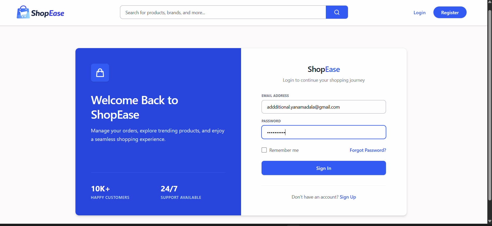 |

---

### Home Page

| Home |
|-------|
| 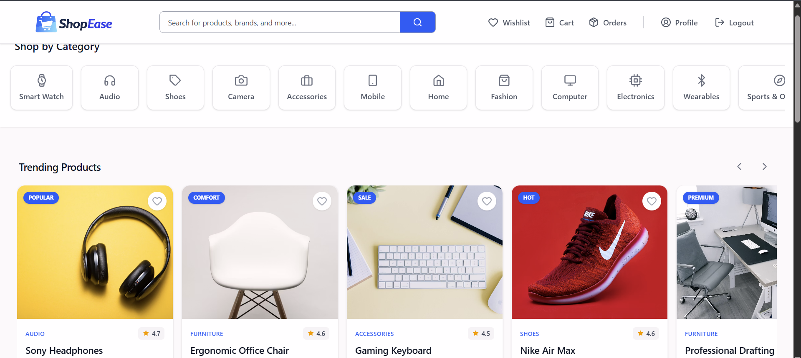 |

---

### Product Details

| Product Details |
|----------------|
| 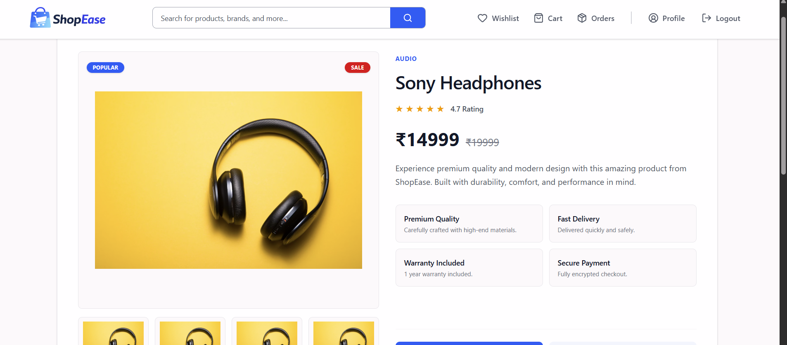 |

---

### Wishlist & Cart

| Wishlist | Cart |
|-----------|------|
| 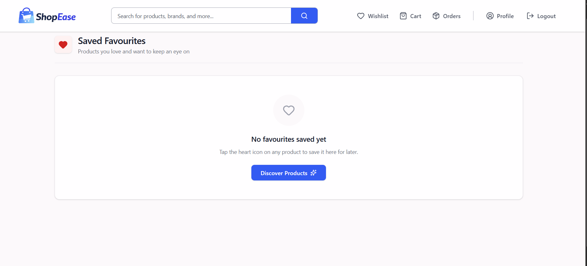 | 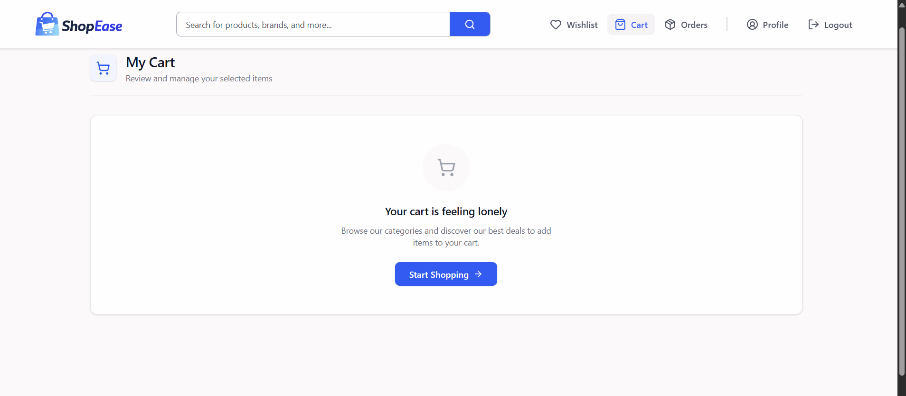 |

---

### Checkout Process

| Address Selection | Payment |
|-------------------|---------|
| 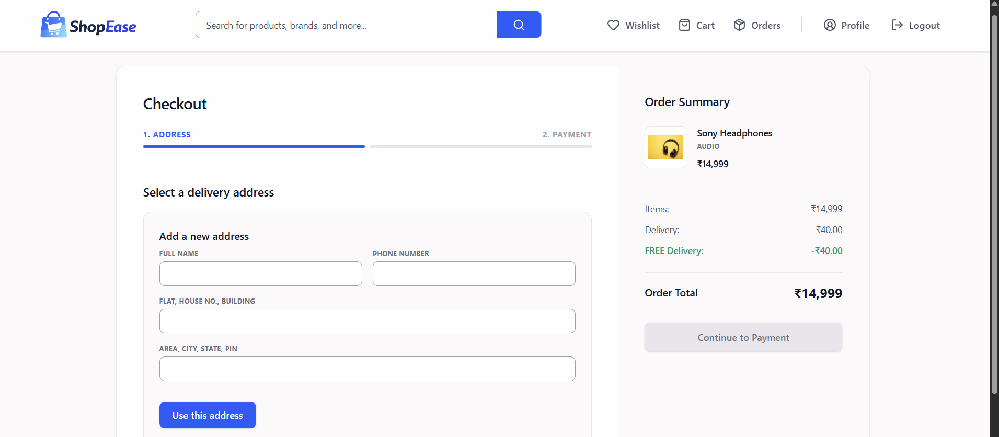 | 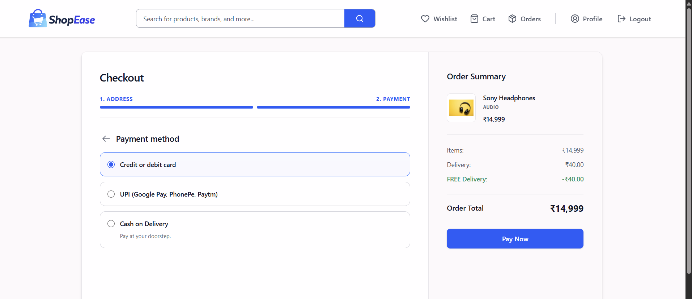 |

---

### Orders

| Orders | Order Tracking |
|---------|----------------|
| 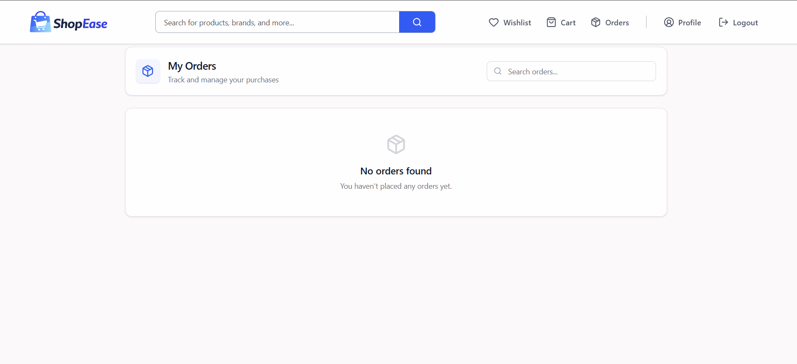 | 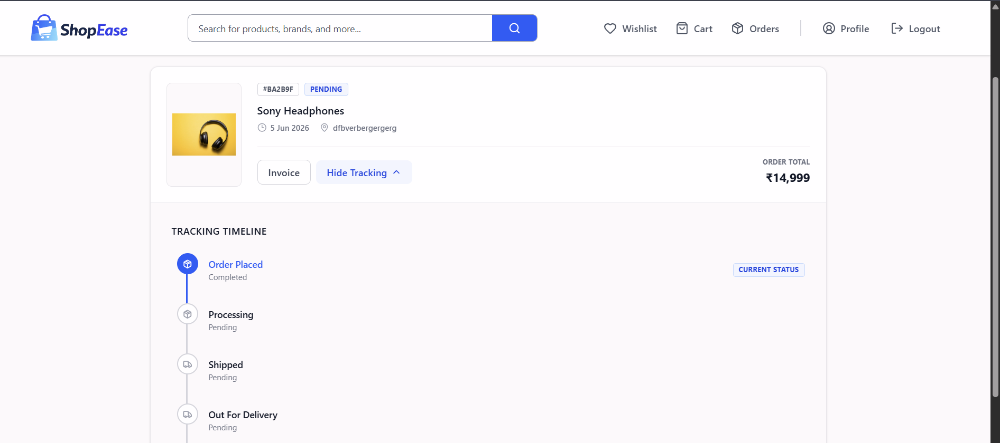 |

---

### User Profile

| Profile |
|----------|
| 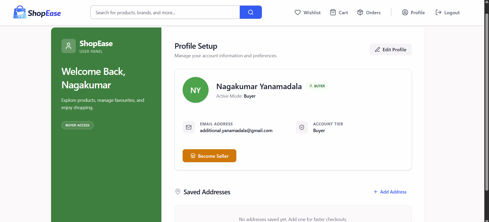 |

---

### Seller Dashboard

| Seller Products | Add Product |
|----------------|-------------|
| 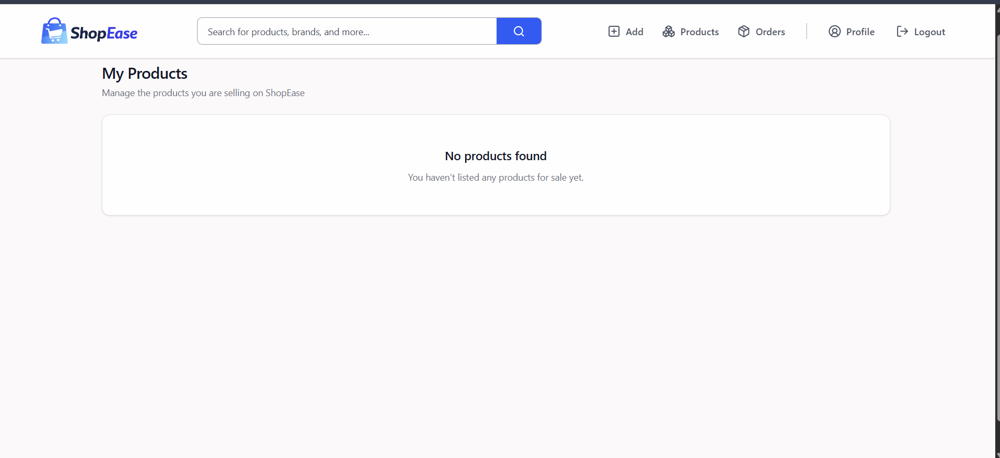 | 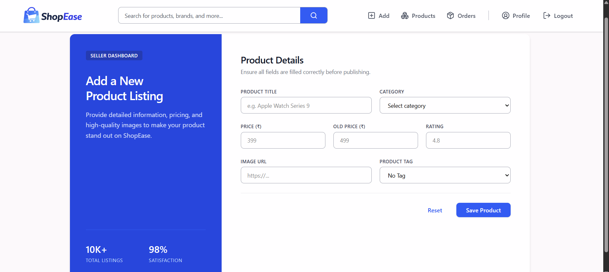 |

---

### Seller Order Management

| Seller Orders |
|---------------|
| 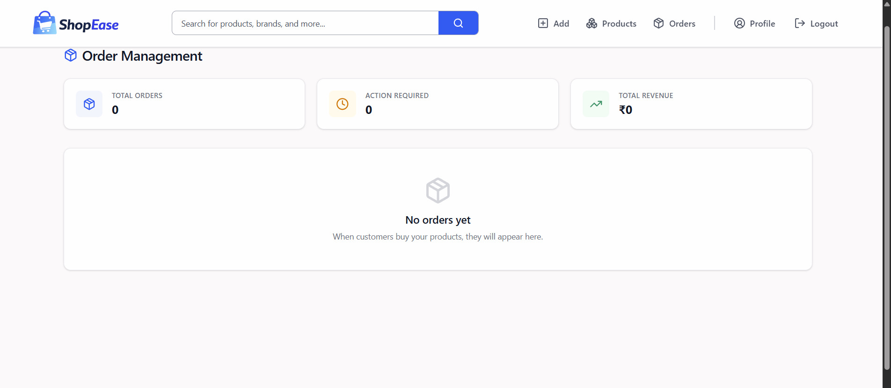 |

---

## ⚙️ Installation

### Clone Repository

```bash
git clone https://github.com/nagakumar-yanamadala/Shop-Ease.git
cd Shop-Ease
```

---

## Backend Setup

```bash
cd backend
npm install
```

Create `.env` inside backend:

```env
MONGO_URI=your_mongodb_connection_string

MAIL_USER=your_email@gmail.com

MAIL_PASS=your_app_password

FRONTEND_URL=http://localhost:5173

SESSION_SECRET=your_session_secret
```

Start backend:

```bash
npm start
```

---

## Frontend Setup

```bash
cd frontend
npm install
```

Create `.env` inside frontend:

```env
VITE_API_URL=http://localhost:3000
```

Start frontend:

```bash
npm run dev
```

---

## 🌐 Application URLs

Frontend:

```text
http://localhost:5173
```

Backend:

```text
http://localhost:3000
```

---

## 🔌 API Features

- User Authentication
- Product CRUD Operations
- Wishlist Management
- Cart Management
- Address Management
- Order Management
- Seller Product Management
- Role-Based Authorization

---

## 🔒 Security Features

- Password Hashing with bcrypt
- Protected Routes
- Session-Based Authentication
- Role-Based Authorization
- Environment Variable Protection

---

## 📚 What I Learned

- Building scalable REST APIs using Express.js
- MongoDB schema design using Mongoose
- Authentication and Authorization
- MERN Stack Architecture
- State Management with Context API
- Responsive UI Development
- E-Commerce Workflow Design
- Full Stack Application Development

---

## 🎯 Future Improvements

- Razorpay Integration
- Stripe Integration
- Product Reviews & Ratings
- Cloudinary Image Uploads
- Seller Analytics Dashboard
- Real-Time Notifications
- Advanced Product Filtering
- Admin Dashboard
- Product Recommendations

---

## 👨‍💻 Author

**Nagakumar Yanamadala**

- GitHub: https://github.com/nagakumar-yanamadala
- LinkedIn: https://www.linkedin.com/in/nagakumar-yanamadala/

---

## ⭐ Support

If you found this project useful, please consider giving it a star ⭐ on GitHub.
